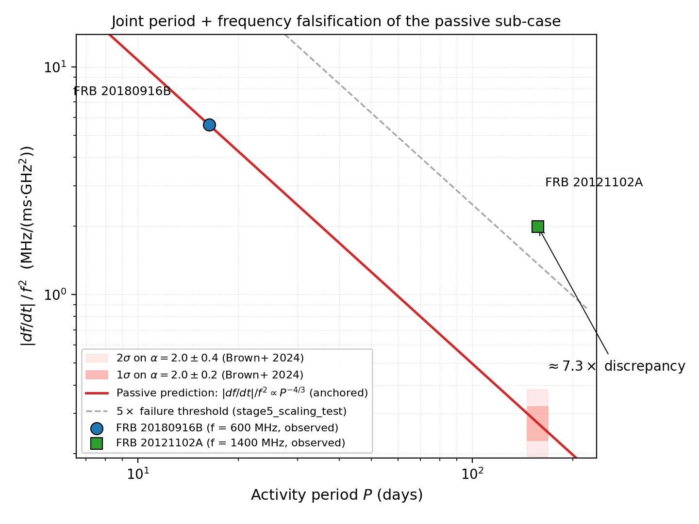
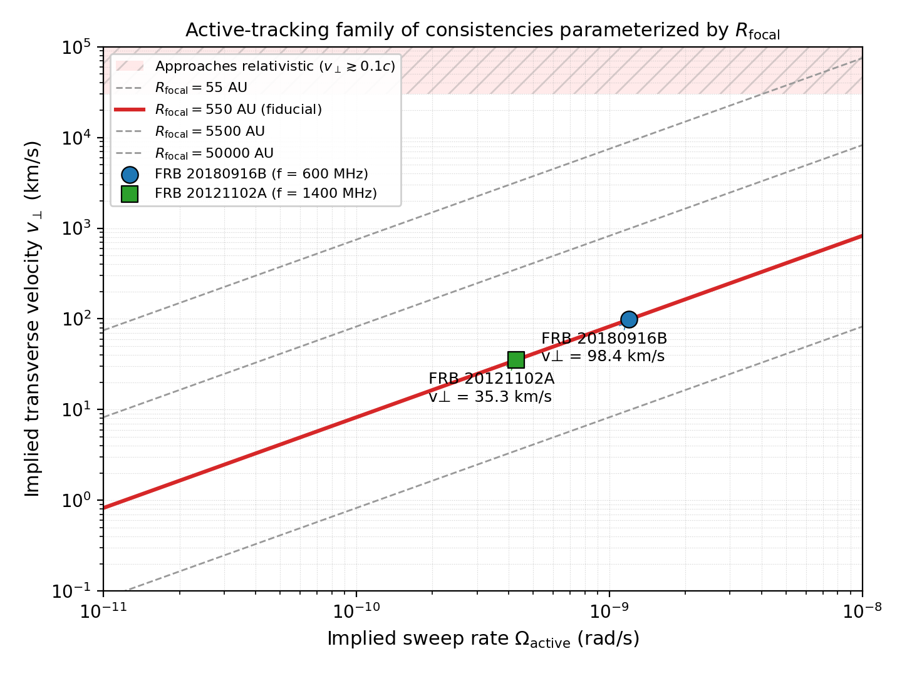

# A Parsimonious Active-Tracking Beam-Sweep Model for Periodic Repeating Fast Radio Bursts: Consistency with Existing Data and Falsification of the Passive-Aberration Variant

**Alex Liu**

**2026**

---

## Abstract

Periodic repeating fast radio bursts (FRBs) — millisecond-duration, cosmologically distributed radio transients with reproducible activity windows on day-to-month timescales — have motivated a wide range of source models, none of which is currently settled. We examine a directed-beam interpretation of periodic FRBs using only standard physics: geometric optics for the beam, Keplerian orbital mechanics, and classical kinematics, with no exotic emission, propagation, or new fundamental physics invoked. The framework gives rise to a proposed *active-tracking model* — in which a beam of stellar-sized effective aperture is aimed by an in-source mechanism — and to a specific testable *passive (aberration-locked) sub-case* of it, in which the beam's sweep rate is constrained to equal the orbital aberration rate of a circular Keplerian orbit. The passive sub-case predicts $|df/dt| \propto D \cdot f^2 \cdot P^{-4/3}$ (Section 2); the two representative anchor drifts we use are reported in different observing bands (FRB 20180916B in CHIME band ~600 MHz, FRB 20121102A in Hessels et al. 2019's L-band ~1400 MHz), and the test exploits the model's own predicted ratio — which carries both the period and frequency scaling jointly — without applying any external frequency normalization. The passive sub-case fails the resulting two-source comparison by a factor of approximately 7.3 (predicted ratio 0.267, observed ratio 1.95), which is above the pre-declared failure threshold of 5 used by `stage5_scaling_test.py`. The active-tracking model, applied to the same two representative drift values under a fiducial aperture (the solar diameter) and a fiducial focal-distance scale (550 AU), maps those drifts to non-relativistic transverse beam-sweep velocities of order 30 to 100 km/s — comparable to ordinary stellar peculiar motions. This is a non-discriminating consistency result, not a confirmation: the model carries a free in-source parameter that maps any observed drift to some velocity, and the inferred velocities scale linearly with the adopted fiducial focal-distance. The model's principal scientific appeal is parsimony — every ingredient of the calculation is empirically grounded standard physics — but the model is also silent on polarization-angle behavior, rotation-measure evolution, scattering, and other diagnostics that natural alternative models address; this silence is a structural limitation of the model's current scope, not merely a data-completeness issue. We enumerate the discriminating extensions and the data that would be required to convert kinematic consistency into a confirming or falsifying test. We do not claim periodic FRBs are directed beams; we claim that one specific directed-beam configuration maps two representative drift values to plausible velocities using only standard physics, that the passive sub-case of the same configuration is falsified under those assumptions, and that the conditions for discrimination can be stated explicitly.

---

## 1. Introduction

Fast radio bursts (FRBs) are millisecond-duration radio transients whose extragalactic distances imply isotropic-equivalent energy releases comparable to a substantial fraction of a solar luminosity output integrated over the burst duration (Cordes & Chatterjee 2019; Petroff et al. 2022). The CHIME/FRB experiment alone has now catalogued thousands of FRB events across two public catalogs (CHIME/FRB Collaboration et al. 2021, 2026). A small but scientifically central subset of FRB sources are repeaters; among repeaters, a smaller subset exhibits *periodic* activity. FRB 20180916B has a robust 16.35 day activity cycle with an approximately 5 day active window (CHIME/FRB Collaboration et al. 2020). FRB 20121102A has a reported long activity cycle near 157 days (Rajwade et al. 2020). FRB 20240209A is a candidate periodic source at approximately 126 days (Pal et al. 2025).

The source mechanism producing this periodicity is unsettled. The leading natural candidates — precessing magnetars (Levin et al. 2020), ultra-long-period magnetars (Beniamini et al. 2020), and binary configurations producing orbital modulation (Ioka & Zhang 2020; Lyutikov, Barkov, & Giannios 2020) — each fit some observations and remain in tension with others, and no consensus has emerged. A parallel directed-beam interpretation has been raised in the FRB literature (Lingam & Loeb 2017); the related directed-emitter and gravitational-lens-focusing literature provides the focal-distance scale we adopt as a fiducial (Maccone 2009; see §2.6). To our knowledge, quantitative cross-source falsification criteria of the kind developed in §2 have not been systematically applied to these configurations against the periodicity-and-drift data, and a key question has therefore not been settled: can such an interpretation be made consistent with the available periodicity-and-drift data using only standard physics — physics whose ingredients are already empirically grounded — without invoking new or exotic mechanisms?

This paper takes that question seriously. We construct one directed-beam model — the *active-tracking* model, in which a beam of stellar-sized effective aperture is aimed by an in-source mechanism — and identify a specific testable sub-case of it: the *passive (aberration-locked) sub-case*, in which the beam's sweep rate is constrained to equal the orbital aberration rate of a circular Keplerian orbit. The passive sub-case has no remaining freedom once aperture and companion mass are chosen and produces a quantitative cross-source prediction $|df/dt| \propto P^{-4/3}$. The active-tracking model itself, with the in-source sweep rate as a free parameter, is more flexible — which is also a weakness — and has no cross-source scaling prediction of its own. Both configurations use only geometric optics, Keplerian orbital mechanics, and classical kinematics; no element of the calculation invokes physics outside the standard-model + general-relativity + classical-electromagnetism framework.

Our contribution is threefold. First, we derive both configurations from a minimal set of assumptions and write down the falsification surface for each (Section 2). Second, we test the passive sub-case against two anchor sources and report a two-source falsification under representative literature drift values (Section 4.1). Third, we propose the active-tracking model as the surviving configuration, demonstrate that it maps the same two representative drift values to plausible transverse velocities using only standard physics under explicit fiducial assumptions, and enumerate the discriminating extensions of the model — both in pre-declared parameter priors and in data — that would be required to convert kinematic consistency into a confirming or falsifying test (Sections 4.3 and 5). The full pipeline, including stages for data validation, propagation/measurement controls, and natural-comparator checks, is publicly available at <https://github.com/alexliu1420/frb-periodicity> with permanent archive at the Zenodo DOI listed in §Code and Data Availability. New periodic repeaters can be added through a documented contribution workflow as suitable measurements become available.

We are explicit about scope. We do *not* claim that the active-tracking model is confirmed. We claim that it maps two representative literature drift values to plausible transverse velocities under explicit fiducial assumptions, that its passive sub-case is falsified under the same assumptions, and that the conditions for discriminating the model from natural alternatives can be stated explicitly. The model is one of several falsifiable candidates for the periodicity mechanism; the question of which is correct requires the discriminating tests of Section 5 applied uniformly across all candidates.

---

## 2. Method

### 2.1 Shared beam geometry

Consider a directed beam of effective aperture `D` emitting at observing frequency `f`. Standard geometric optics gives a characteristic beam divergence $\theta \sim \lambda/D = c/(fD)$. Differentiating with respect to $f$ at fixed `D` gives

$$d\theta/df = -\,c/(D\,f^2),$$

so a fixed observer offset within the beam corresponds to a frequency that scales inversely with the beam's instantaneous half-angle. If the beam sweeps across the observer's line of sight with instantaneous angular rate $\Omega \equiv d\theta/dt$, the chain rule $df/dt = (df/d\theta) \cdot (d\theta/dt)$ together with the inverse-function relation $df/d\theta = 1/(d\theta/df)$ yields

$$df/dt = -\,(D \cdot f^2 \cdot \Omega) / c \tag{1}$$

equivalently, the time required for the beam edge to traverse the observer's frequency band. Equation (1) is the load-bearing relation for everything that follows. It contains no source physics beyond beam geometry; the model and its sub-case differ only in what sets $\Omega$.

### 2.2 The passive (aberration-locked) sub-case

In the passive sub-case, the sweep rate is constrained to equal the kinematic consequence of orbital motion alone. For a circular Keplerian orbit of period `P` around a companion of mass `M`, the centripetal acceleration $a_{\rm orb} = v_{\rm orb}^2 / r_{\rm orb}$ induces a small-angle aberration that changes at rate

$$\Omega_{\rm passive} = a_{\rm orb} / c \tag{2}$$

Combining (1) and (2) with Kepler's third law $a_{\rm orb} \propto M^{1/3} P^{-4/3}$ yields the cross-source prediction

$$|df/dt| \propto P^{-4/3} \tag{3}$$

at fixed aperture, frequency, and companion mass. Equation (3) is a quantitative, testable prediction: across multiple periodic sources sharing the same effective aperture and companion-mass class, the magnitudes of their representative sub-burst drift rates — normalized to a common observing frequency — should follow $P^{-4/3}$.

The passive sub-case has no remaining free parameters once `D` and `M` are chosen. This makes it the variant of the model with the smallest falsification surface. It is also the variant that fails when tested (Section 4.1).

### 2.3 The active-tracking model

In the active-tracking model, the sweep rate $\Omega$ is set by an in-source mechanism (a beam aimed by a process internal to the source, not purely by orbital motion). Equation (1) is unchanged, but $\Omega$ is now an in-source parameter inferred from the observed drift rather than predicted from orbital kinematics:

$$\Omega_{\rm active} = |df/dt| \cdot c / (f^2 \cdot D) \tag{4}$$

For an emitter whose beam pivot point lies at fiducial focal distance `R_focal` from the line of sight, the implied transverse beam-sweep velocity at the focal plane is

$$v_\perp = \Omega_{\rm active} \cdot R_{\rm focal} \tag{5}$$

The active-tracking model does not predict the cross-source $P^{-4/3}$ scaling — that prediction belonged to the constrained passive sub-case, where the in-source mechanism happened to be locked to orbital aberration. With $\Omega$ as a free in-source parameter, the model's testable content per source becomes a different question: given an aperture `D` and a focal-distance scale `R_focal`, an observed `(df/dt, f)` pair maps to an implied transverse velocity $v_\perp$. The model is *consistent with a given drift value* if $v_\perp$ falls within physically reasonable kinematic limits; it is *discriminating* only if there is a pre-declared range of velocities the model would forbid. The latter does not yet exist. The paper proposes the model as a parsimonious description that uses only standard physics; the kinematic-consistency result of Section 4.3 is not a confirmation.

A note on what *parsimonious* is and is not buying us. The natural alternative models — precessing magnetars, ultra-long-period magnetars, binary configurations — also use only standard physics. What distinguishes the active-tracking model is not that it invokes less physics but that it *predicts less*. Its smaller free-parameter count, and the absence of any need for exotic emission or propagation, is bought by the model's silence on PA, RM, scattering, and burst-energetics diagnostics (see Section 5.2). The parsimony argument applies to the ingredients of the calculation, not to comparative explanatory power; it does not establish the active-tracking model as preferable to the natural alternatives on Occam's razor grounds. This is a genuine trade-off and we treat it as one.

### 2.4 The fiducial aperture: motivation, not prediction

Both configurations require an effective aperture `D`. We adopt the solar diameter $D \approx 1.392 \times 10^6$ km as a fiducial scale, motivated by the single-source aperture coincidence reported in Section 4.2 (the aperture that reproduces the FRB 20180916B drift under the passive equations is within a few percent of the solar diameter). This coincidence is a *scale-setting observation*, not evidence for the underlying mechanism, and we treat it accordingly throughout. A different aperture rescales all inferred velocities and energies linearly; the sensitivity of derived quantities to this choice is discussed in Sections 4.3 and 6.3.

### 2.5 The fiducial focal distance

The active-tracking model additionally requires a focal-distance scale `R_focal`. We adopt `R_focal = 550 AU` as a fiducial normalization. This is *a scale*, not a derived extragalactic geometry: the inferred transverse velocities scale linearly with `R_focal`, and the choice is explicit in every velocity we report. The physical motivation for this specific value, and its relation to the prior directed-emitter literature, is given in §2.6. Section 6.3 returns to what would constrain `R_focal` independently.

### 2.6 Parameter regime and prior literature

The fiducial scales adopted in §§2.4–2.5 — a stellar-diameter aperture and $R_{\rm focal} \approx 550$ AU — fall in a regime that overlaps the directed-emitter and gravitational-lens-focusing literature (Lingam & Loeb 2017; Maccone 2009). The 550 AU value is the focal distance at which gravitational lensing by a star of approximately solar mass comes to focus for radio wavelengths (the scale canonically computed for the Sun in Maccone 2009 and applicable to any solar-mass star), and we adopt it because it is the only well-motivated standard-physics focal-distance scale in the directed-beam literature at the relevant order of magnitude. No narrower physical argument fixes $R_{\rm focal}$ within the model itself; §6.3 returns to what would. We make no claim about the nature of the in-source aiming mechanism. The kinematic-consistency result of §4.3 holds in this parameter regime; whether physically motivated in-source mechanisms exist that produce these scales is a separate question the present paper does not address.

### 2.7 Beaming and energy budget

The same aperture assumption permits a sensitivity calculation for the beaming correction to inferred burst energetics. For a circular cone of divergence $\theta \sim \lambda/D$, the solid angle is $\Omega_{\rm beam} = \pi (\theta/2)^2$, the beaming fraction is $\Omega_{\rm beam} / 4\pi$, and the beaming-corrected energy is the isotropic-equivalent energy scaled by this fraction. We present this as a sensitivity calculation, not as a measurement; the aperture is an assumption, the active-tracking model does not specifically predict burst energetics, and the energy calculation should not be read as a test of the model.

### 2.8 Implementation

The pipeline is implemented as a sequence of stage scripts in Python with shared physical constants and equations centralized to prevent silent inconsistencies. Unit tests pin the canonical anchor values against the equations as implemented. Full code, equation tests, and reproducibility instructions are in the repository.

---

## 3. Anchor Sources and Data

Two periodic repeating FRB sources meet the criteria for the present analysis: a robust periodicity claim in the published literature, and a representative sub-burst drift value with stated observing frequency.

**FRB 20180916B.** Activity period $P = 16.35$ d with approximately 5 d active window (CHIME/FRB Collaboration et al. 2020). Host: a nearby spiral galaxy at $z = 0.0337$ (Marcote et al. 2020). Representative sub-burst drift $df/dt \approx -2.0$ MHz/ms at $f \approx 600$ MHz (Pleunis et al. 2021).

**FRB 20121102A.** Reported long activity cycle $P \approx 157$ d (Rajwade et al. 2020); window estimates vary across analyses. Host: dwarf star-forming environment at $z = 0.19273$ (Tendulkar et al. 2017). Representative sub-burst drift $df/dt \approx -3.9$ MHz/ms at $f \approx 1400$ MHz (L-band; Hessels et al. 2019). The cross-band comparison between this anchor and the CHIME-band FRB 20180916B drift is discussed in §3.1.

For both sources the drift values are *representative literature anchors*, not the result of a uniform burst-level reanalysis. We use them as exploratory anchors throughout. The controls required to convert representative drifts into source-level measurements are listed in Section 5.

A third source, FRB 20240209A ($P \approx 126$ d, candidate-level periodicity), is tracked in the pipeline's demographic context but does not enter the two-source test below. The discovery and localization paper (Shah et al. 2024) presents dynamic spectra for ten CHIME baseband bursts, reports the host galaxy redshift $z = 0.1384 \pm 0.0004$, and notes that bursts B1, B5, B8, B9, and B16 show qualitative downward-drifting morphology in the frequency–time space, but does not report a quantified $df/dt$ value comparable to those of Hessels et al. (2019) or Pleunis et al. (2021). The periodicity analysis (Pal et al. 2025) reports the ~126-day activity cycle and burst-level metadata (arrival times, dispersion measures, signal-to-noise ratios) without analyzing sub-burst time-frequency structure. Until a published $df/dt$ measurement of the kind reported for the two anchor sources above becomes available, FRB 20240209A cannot enter Sections 4.1 or 4.3. It enters the pipeline via the contribution workflow once such a measurement is published.

Catalog-scale context is drawn from CHIME/FRB Catalog 1 (CHIME/FRB Collaboration et al. 2021) and Catalog 2 (CHIME/FRB Collaboration et al. 2026). Catalog 2 expands the public repeater sample to 83 named repeater sources and 4,539 unique FRB events but does not by itself add a new analysis anchor, because periodicity and burst-level drift both require separate analysis beyond catalog metadata. Future anchor sources enter the pipeline through the contribution workflow described in `CONTRIBUTING.md`.

Throughout the rest of the paper, "the anchor data" or "the two-source test data" refers specifically to the two `(P, df/dt, f)` tuples above.

### 3.1 Observing frequencies and the $f^2$ scaling

The two representative drift values used in this paper are reported at different observing frequencies. FRB 20180916B's $df/dt \approx -2.0$ MHz/ms is drawn from CHIME's 400–800 MHz band, with $f \approx 600$ MHz as the band center used for the present comparison. FRB 20121102A's $df/dt \approx -3.9$ MHz/ms is a representative value within Hessels et al. 2019's reported range of −3 to −4 MHz/ms for bursts observed at L-band (1.1–1.7 GHz; $f \approx 1400$ MHz used here). The two anchors are therefore in observing bands separated by a factor of approximately 2.3 in frequency.

The passive sub-case derived in Section 2.2 predicts that drift magnitude scales as $f^2$ at fixed aperture and sweep rate. We do not apply any external frequency normalization to the observed values before testing. Instead, the test proceeds by predicting `df/dt` for each source *at its own native observing frequency* using equation (1), and comparing the resulting predicted cross-source ratio to the observed cross-source ratio. The model's intrinsic $f^2$ scaling is therefore part of what is being tested: a passive aberration-locked beam with the same effective aperture across both sources must reproduce *both* the period and the frequency scaling jointly.

There is a small methodological circularity worth surfacing explicitly. The $f^2$ scaling is one ingredient of the passive sub-case being tested; it is also the relation that allows us to compare drift values measured in different bands at all. If a referee were to insist on frequency-normalizing the observed values before the test, the relation used to normalize would be equation (1)'s $f^2$ law — which is precisely what the test relies on. We do not regard this as an unfair advantage for the model under test, because (i) the test outcome is robust to either implementation — predicting at native frequencies and comparing ratios (our choice), or normalizing both observations to a common reference frequency before comparing them, give the same discrepancy factor (Section 4.1) — and (ii) the assumption that $|df/dt| \propto f^\alpha$ with $\alpha$ close to 2 holds for sub-burst drift in repeating FRBs is independently supported by literature analyses of the same population.

The relevant literature anchor is Brown et al. (2024), who fit a free power law to sub-burst drift across nine repeating FRB sources (including both anchor sources used here) spanning observing center frequencies from 149 MHz to 7144 MHz. Their reported global fit is $\alpha = 2.0 \pm 0.2$, with per-source scatter consistent with intrinsic spread. The $1\sigma$ uncertainty propagates into the present test as follows:

| $\alpha$ | Predicted ratio | Discrepancy factor |
| ---: | ---: | ---: |
| 1.8 ($-1\sigma$) | 0.225 | 8.7× |
| 2.0 (Brown central) | 0.267 | **7.3×** |
| 2.2 ($+1\sigma$) | 0.321 | 6.1× |

The falsification result is robust across the $1\sigma$ range on $\alpha$: the passive sub-case fails the 5× threshold for all values of $\alpha$ within Brown et al.'s reported uncertainty. At the $2\sigma$ boundary ($\alpha \approx 2.4$) the discrepancy falls to ~5.2×, still marginally above the threshold; at $\alpha \gtrsim 2.5$, the test becomes non-discriminating. The falsification therefore relies on the narrow-band $\alpha$ for FRB sub-burst drift being within Brown et al. 2024's reported range, which is the assumption we adopt and cite.

---

## 4. Results

### 4.1 The passive sub-case fails the two-source comparison

The passive sub-case of Section 2.2 predicts that across periodic sources sharing the same effective aperture and companion-mass class, drift magnitudes follow $|df/dt| \propto f^2 \cdot P^{-4/3}$. Evaluating both observed and predicted values at each source's native observing frequency (see §3.1):

| Source | `P` (d) | `f` (MHz) | Observed `df/dt` (MHz/ms) | Predicted `df/dt` (MHz/ms) |
| --- | ---: | ---: | ---: | ---: |
| FRB 20180916B | 16.35 | 600 | −2.0 | −2.08 |
| FRB 20121102A | 157.0 | 1400 | −3.9 | −0.555 |

(Predicted values from `stage5_scaling_test.py`; full numerical output preserved in the repository.)

The model's predicted cross-source ratio carries both the period and frequency dependence: $(f_2/f_1)^2 \cdot (P_1/P_2)^{4/3} \approx 0.267$. The observed ratio is $1.95$. The discrepancy factor is therefore $1.95 / 0.267 \approx 7.3$, above the pre-declared failure threshold of $5.0$ used by `stage5_scaling_test.py`. Equivalently, normalizing FRB 20121102A's observed drift from 1400 MHz to 600 MHz via $df/dt(600) = -3.9 \times (600/1400)^2 \approx -0.717$ MHz/ms and comparing against the passive prediction of $-0.102$ MHz/ms at 600 MHz gives the same $0.717 / 0.102 \approx 7.0$ discrepancy (the small numerical difference is rounding); the two implementations of the test agree by construction. Under its own assumptions — fixed aperture, circular Keplerian orbit, sweep rate locked to orbital aberration, $f^2$ beam-width scaling — the passive sub-case fails the two-source comparison.

The 7.3× discrepancy is sensitive to two choices that should be made explicit. First, the representative drift value for FRB 20121102A is taken from Hessels et al. 2019's reported −3 to −4 MHz/ms range at L-band; the same calculation with the upper-magnitude end of this range gives a discrepancy near 7.5×, with the lower-magnitude end near 5.6×. The discrepancy remains above the 5× failure threshold across this entire range. Second, the test treats both anchor sources as sharing the same effective aperture and companion-mass class; relaxing this assumption opens additional degrees of freedom and changes the falsification surface (Section 5.2 returns to this). Note in particular that the $M^{1/3}$ scaling limits how much companion-mass freedom can absorb: erasing the 7.3× discrepancy through companion mass would require $M^{1/3}$ to absorb the full factor, i.e. FRB 20121102A's companion would need a mass $7.3^3 \approx 390$ times that of FRB 20180916B's companion. That is far outside any single stellar regime and incompatible with the same-companion-class assumption the test makes; mixed-class scenarios (e.g., one stellar and one degenerate companion) remain logically open but require additional structure that the present minimal model does not provide.

This is a useful negative result. It eliminates one specific sub-case of the directed-beam model family — the variant in which the in-source sweep rate is fully determined by orbital aberration — and narrows the model space the rest of the paper considers. We emphasize that the 7.3× failure is a threshold-based result against the pre-declared 5× criterion in `stage5_scaling_test.py`, not a statistical rejection from a uniform burst-level sample: a single representative drift value per source carries no per-burst uncertainty budget, and a more discriminating test requires per-burst drift distributions of the kind enumerated in §5.2.

**Figure 1.** Falsification of the passive (aberration-locked) sub-case by joint period + frequency comparison. Data points show FRB 20180916B (`df/dt = −2.0 MHz/ms` at 600 MHz) and FRB 20121102A (`df/dt = −3.9 MHz/ms` at 1.4 GHz). The y-axis $|df/dt|/f^2$ is the f²-normalized observable, chosen so that the passive model's full $f^2 \cdot P^{-4/3}$ prediction reduces to a pure $P^{-4/3}$ line under $\alpha = 2$. The solid red line is that prediction, anchored to FRB 20180916B; FRB 20121102A's observed value sits approximately 7.3× above this line, indicating that the joint period+frequency scaling required by the passive sub-case fails the two-source test. The dashed gray line shows the pre-declared 5× failure threshold from `stage5_scaling_test.py`. Shaded bands at the longer-period point show the prediction uncertainty propagated from Brown et al. 2024's $\alpha = 2.0 \pm 0.2$: $1\sigma$ band (darker pink, discrepancy 6.2–8.7×) and $2\sigma$ band (lighter pink, discrepancy 5.2–10.3×). The observed point sits above the 5× threshold even at the $2\sigma$ boundary of the literature uncertainty.

### 4.2 The single-source aperture coincidence

For FRB 20180916B, inverting the passive equations (1)–(2) to ask what aperture would reproduce the observed drift gives

$$D_{\rm required} \approx 1.34 \times 10^6 \text{ km} \tag{6}$$

($D_{\rm required} = 1.338 \times 10^6$ km from `frb/models.py` / Stage 4 output.)

This is within approximately 4% of the solar diameter (`1.392 × 10^6 km`; the ratio is 0.961). We do not interpret this as evidence for the passive sub-case — Section 4.1 already eliminates it. The coincidence functions instead as a *scale-setting observation* for the active-tracking model: it motivates the use of the solar diameter as the fiducial aperture in equations (4)–(5), without claiming that the aperture is the solar diameter for any physical reason. We use the falsified passive equations only as a dimensional anchor here; nothing in the active-tracking model itself requires this scale, and a different aperture rescales all subsequent inferred velocities linearly. The choice is a fiducial scale, not a measurement.

### 4.3 The active-tracking model maps both anchor drifts to plausible kinematic velocities

Applying the active-tracking equations (4)–(5) with the fiducial aperture and `R_focal = 550 AU` to the two anchor drift values at their native observing frequencies:

| Source | `df/dt` (MHz/ms) | `f` (MHz) | Implied $\Omega_{\rm active}$ (rad/s) | Implied $v_\perp$ (km/s) |
| --- | ---: | ---: | ---: | ---: |
| FRB 20180916B | −2.0 | 600 | $1.20 \times 10^{-9}$ | 98.4 |
| FRB 20121102A | −3.9 | 1400 | $4.29 \times 10^{-10}$ | 35.3 |

(Sweep rates and velocities from `stage6_active_tracking.py` at `D` = solar diameter and `R_focal` = 550 AU.)

A note on inversion convention. Section 4.1's two-source comparison uses the model's predicted cross-source ratio, which carries the $f^2$ scaling internally and lets the test exploit equation (1) without externally normalizing the observed values. The per-source inversion of Section 4.3 is different: each source's observed `(df/dt, f)` pair is inverted at that source's native observing frequency via equations (4)–(5), and the inferred $\Omega$ and $v_\perp$ are the per-source quantities the model says were happening at the source. The two conventions exist for different purposes — cross-source falsification in §4.1, per-source kinematic interpretation here — and we use both.

The implied transverse velocities are non-relativistic and within plausible kinematic limits — of order tens to ~100 km/s under the fiducial scales, well below the speed of light, and spanning the range from typical stellar peculiar motions to the lower end of galactic-disk-scale kinematics. The model maps both anchor drift values to such velocities using only equations (1) and (4)–(5). Note that the velocity inferred for FRB 20121102A is smaller than for FRB 20180916B even though its observed `df/dt` magnitude is larger: the active-tracking sweep rate $\Omega$ (equation 4) scales as $df/dt \cdot f^{-2}$, and the factor of $(1400/600)^2 \approx 5.4$ in $f^2$ for FRB 20121102A more than compensates the factor of 1.95 in `df/dt`.

Three points about what this result does and does not establish.

**First — the calculation uses only standard physics.** Geometric optics for the beam-width relation; classical kinematics for the sweep velocity; Keplerian mechanics for the period normalization in the passive sub-case (the active-tracking model itself does not depend on the orbital geometry). Every ingredient of the calculation is already empirically grounded. No element invokes physics outside the standard-model + general-relativity + classical-electromagnetism framework — no exotic emission mechanism, no fine-tuned magnetar configuration, no propagation effect beyond standard geometric optics, no extension to known physical law. This parsimony is the principal scientific appeal of the model: an unknown observation is mapped to known physical quantities by physics whose ingredients are themselves empirically settled.

**Second — the result is not discriminating.** Equation (4) returns some sweep rate for any drift value, and equation (5) returns some velocity for any sweep rate. The active-tracking model carries two free parameters relative to the present data: the in-source sweep rate $\Omega$ (one knob, fixed by the observed drift) and the focal-distance scale `R_focal` (a second knob, fixed by fiducial choice). Two knobs tuned against a two-source test is structurally underconstrained: any consistent outcome is a property of the parameter freedom, not a confirmation of the model. Without a pre-declared prior on what range of $v_\perp$ the model would forbid, kinematic consistency is the weakest possible test outcome — a model that cannot return "inconsistent" cannot be confirmed by returning "consistent." Section 5 lists what would convert this kinematic consistency into a discriminating test.

**Third — the inferred $v_\perp$ values scale linearly with the adopted `R_focal`.** The 550 AU choice is a fiducial normalization, not a derived geometry. A factor-of-ten change in `R_focal` produces a factor-of-ten change in inferred velocity. The kinematic consistency reported here is therefore a *family* of consistencies parametrized by `R_focal`; specifying which value of `R_focal` is correct, or constraining `R_focal` from independent data, is a question Section 6.3 returns to.

To make the `R_focal` dependence concrete, the same FRB 20180916B drift value maps to approximately 10 km/s at `R_focal` = 55 AU, approximately 100 km/s at the fiducial `R_focal` = 550 AU, approximately 1,000 km/s at `R_focal` = 5,500 AU, and approximately 9,000 km/s ($\approx 0.03c$, well above ordinary stellar peculiar motions but below the $0.1c$ heuristic used in Figure 2) at `R_focal` = 50,000 AU ($\approx 10^{-3}$ pc; comparable to outer-Oort-cloud scale). The lower-$\Omega$ FRB 20121102A anchor maps to correspondingly lower velocities at each scale (roughly 3.5 km/s at 55 AU, 35 km/s at 550 AU, 350 km/s at 5,500 AU, 3,200 km/s at 50,000 AU). The 550 AU fiducial sits in the middle of these families, where both anchors' inferred velocities are non-relativistic and broadly plausible. At Oort-scale `R_focal` the implied velocities sit well above ordinary kinematic regimes but remain sub-relativistic for both anchors at every value of `R_focal` explored here; at sub-AU `R_focal` the velocities become very low. The kinematic-consistency claim is therefore not "the model works at the fiducial scale" but "the model maps drifts to velocities in a plausible band for some intermediate range of fiducial scales" — a substantially weaker claim that we make visible alongside the headline result rather than relegating to a single caveat.

**Figure 2.** Active-tracking implied transverse velocity $v_\perp$ as a function of the inferred sweep rate $\Omega$, with contour lines for four choices of the fiducial focal-distance scale `R_focal`. Anchor points for FRB 20180916B (filled circle) and FRB 20121102A (filled square) are placed on the 550 AU fiducial contour (highlighted red), at sweep rates inferred from their representative drift values at their native observing frequencies (600 MHz and 1.4 GHz respectively). The hatched red region at top marks the regime where $v_\perp$ approaches relativistic velocities ($v_\perp \gtrsim 0.1c$), which becomes unphysical for a structure pivoting at the implied scales. The four contours make the model's `R_focal` dependence concrete: at the fiducial 550 AU both anchors fall well within the non-relativistic regime; at Oort-cloud-scale `R_focal` both anchors remain sub-relativistic (FRB 20180916B reaches $\approx 0.03c$, still a factor of three below the 0.1c heuristic), though well above ordinary stellar peculiar motions; at sub-AU `R_focal` velocities become very low. The kinematic-consistency claim of §4.3 is "the model maps drifts to plausible velocities for some intermediate `R_focal` band," not "the model works at the fiducial scale."

### 4.4 Energy-budget sensitivity

Stage 7 of the pipeline applies a single 600 MHz reference frequency to both sources to demonstrate the aperture/frequency sensitivity of the beaming correction; the values below are therefore reference-frequency illustrations and not source-specific energetics estimates for FRB 20121102A, whose representative drift is reported at L-band. Under the fiducial aperture at this 600 MHz reference, the beam divergence is $\theta \approx 3.6 \times 10^{-10}$ rad, the beaming fraction is $\Omega_{\rm beam} / 4\pi \approx 8.1 \times 10^{-21}$, and the beaming-corrected true energies for representative isotropic-equivalent values of $1 \times 10^{38}$ erg (FRB 20180916B) and $1 \times 10^{39}$ erg (FRB 20121102A) are approximately 20 orders of magnitude below the isotropic-equivalent values ($\log_{10} E_{\rm true} \approx 17.9$ and $18.9$ respectively, with implied true powers of order $10^{-13}$–$10^{-12}\,L_\odot$). A source-specific calculation using each source's native frequency would rescale the beaming fraction by $(f_{\rm ref}/f)^2$ — a factor $\approx 5.4$ smaller beaming fraction at 1.4 GHz than at 600 MHz — but does not change the qualitative conclusion that the inferred true energetics are extremely small compared to the isotropic-equivalent.

(Divergence, beaming fraction, and beaming-corrected energy values from `stage7_energy_budget.py`.)

The physical point of this calculation is not the specific reduction factor but its *aperture sensitivity*. Doubling `D` reduces the beaming fraction by a factor of four; an Airy first-null estimate would introduce a 1.22 prefactor and change the beaming fraction by approximately 50%. The active-tracking model does not specifically predict burst energetics, and this calculation is presented to show how strongly any beaming-corrected energy estimate depends on the aperture assumption.

---

## 5. Limitations and Discriminating Extensions of the Model

The active-tracking model maps two representative drift values to plausible transverse velocities under explicit fiducial assumptions. It is not currently confirmed. Two distinct limitations bound what the present analysis can do: limits set by the *data* (we used representative literature values rather than burst-level measurements; we have only two anchor sources), and limits set by the *model itself* (its testable content is equation (1) alone; it is silent on several diagnostics that natural alternative models address). Both kinds of limit have to be lifted for the present consistency result to become a discriminating one.

### 5.1 Data-side limitations the model could be tested against if lifted

**Burst-level drift measurement provenance.** For each `df/dt` value entering the test, the following must be recorded and propagated: the dedispersion method (coherent baseband strongly preferred over intensity dedispersion); the observing frequency and bandwidth; an uncertainty derived from the measurement rather than assumed; the scattering time and scintillation bandwidth at the observation; and the activity-window provenance. A uniform burst-level reanalysis of all bursts from both anchor sources, replacing the single representative literature value per source, is the most important data upgrade.

**A pre-declared kinematic prior on $v_\perp$.** The active-tracking model currently lacks a pre-declared range of transverse velocities it forbids. Without that range, equation (5) is a tautology: it always returns *some* velocity. A discriminating prior would specify, on independent physical grounds, what $v_\perp$ (or what $v_\perp$ distribution across bursts) the model would reject. Specifying this prior independently of the FRB data is a precondition for treating any future drift measurement as a confirming or falsifying observation.

**Frequency-scaling verification across CHIME's bandpass.** Equation (1) predicts $df/dt \propto f^2$ at fixed `D` and $\Omega$. A discriminating test verifies or falsifies this scaling within the bandpass of a single instrument, on a single source, in a single observing window. The same prediction is shared with several natural sub-burst slope laws (Brown et al. 2024), so this test alone does not discriminate the model from those alternatives, but it is a necessary consistency check that the present analysis does not yet apply. Note also that the cross-band comparison of Section 4.1 depends on $\alpha \approx 2$ holding in the 600 MHz – 1.4 GHz range; Brown et al. 2024's global fit ($\alpha = 2.0 \pm 0.2$ across 149–7144 MHz with nine sources) supports this, but a tighter per-source narrow-band measurement of $\alpha$ for both anchor sources would constrain the falsification more precisely and is a worthwhile data-side control.

**Burst-to-burst drift distribution.** A single representative drift per source is the wrong observable for a discriminating test. The model, once equipped with a pre-declared prior on $v_\perp$, predicts a *distribution* of drifts shaped by the in-source tracking mechanism. Burst-level drift distributions, with quantified uncertainty per burst, are required.

**Sample-size discipline.** Two robust periodic repeaters plus one candidate is below the threshold at which population-level inferences are justified. Population-level claims are not made at the current sample size. Future periodic repeaters can be added through `CONTRIBUTING.md` as suitable measurements are published.

### 5.2 Model-side limitations the model would have to be extended to address

**The model is silent on polarization-angle behavior.** Equation (1) predicts a frequency drift; it makes no prediction about polarization-angle (PA) swings during a burst or about PA evolution across the activity window. Natural alternative models are testable in both dimensions and have been so tested. At the intra-burst scale, Liu et al. 2025 systematically applied the rotating vector model (RVM) to PA swings within individual bursts across 1,727 bursts from three FAST-monitored repeating sources, finding 46 bursts whose intra-burst PA variations are consistent with the RVM but with mutually inconsistent inferred geometric parameters across them. At the activity-window scale, Bethapudi et al. 2025 used uGMRT PA observations of FRB 20180916B to robustly rule out all flavors of precessional models for the 16-day periodicity, while rotational models remain partially consistent and require further constraint. Whether the active-tracking model can be *extended* to predict PA behavior at either timescale — for example, by specifying the geometry of the in-source aiming mechanism — is a separate theoretical exercise. Until that extension is made, the model has less falsification surface in this diagnostic than the natural alternatives have, which is a structural disadvantage, not a temporary data shortage.

**The model is silent on rotation-measure behavior.** FRB 20180916B's RM evolution shows a three-phase structure: an early stochastic phase around a baseline of $\approx -114.6$ rad m$^{-2}$, a secular linear-trend phase, and a return to stochastic variation around a shifted baseline of $\approx -58.75$ rad m$^{-2}$ (Bethapudi et al. 2024). RM behavior is an active observational diagnostic for repeating FRBs more broadly — Liang et al. 2025 report a candidate ~200-day periodic RM evolution in FRB 20220529 and discuss a binary-system origin as one possible interpretation; Li et al. 2026 perform a systematic search for RM-flare candidates across the repeater population using multi-epoch RM measurements. Natural alternative models in which the RM environment is set by a binary companion or by source-local magneto-ionic structure can in principle be confronted with these observations. The active-tracking model in its current form does not predict RM behavior at all.

**The model is silent on scattering and scintillation.** Burst-by-burst variation in scattering time and scintillation bandwidth is a real and useful diagnostic in current FRB work. The model does not predict it.

**The model is silent on burst energetics beyond the beaming-geometry sensitivity.** The §4.4 calculation is geometry-of-the-beam, not a prediction of the energy distribution across bursts or sources.

**The model is silent on activity-window structure.** FRB 20180916B is active for approximately 5 days within its 16.35-day period (CHIME/FRB Collaboration et al. 2020) and quiet during the remaining ~11 days. The active-tracking model in its current form predicts neither the duty-cycle fraction nor the activity-window shape; these would have to fall out of a specified geometry of the in-source aiming mechanism, which the present minimal model does not provide. Natural alternative models with orbital or precessional geometries have a more direct route to this observable.

Whether this gap is bridgeable in principle depends on whether the in-source aiming mechanism — currently a black box in the model — can be specified geometrically in a way that produces predictions for PA, RM, and other diagnostics. We do not take a position on whether such a specification is possible. We note only that until it is provided, the gap is *constitutive* of the model's current scope rather than an incidental data shortage; the model and its natural alternatives are not on equal footing in this respect.

The honest summary is that the model in its current form predicts one thing — equation (1) — and is consistent in the weak sense described in Section 4.3 with the two anchor drift values that test it. Natural alternative models predict more, are tested against more, and therefore have more falsification surface. Closing this gap requires either extending the model to make predictions for PA, RM, scattering, and energetics — substantial theoretical work — or accepting that the model's appeal is restricted to the parsimony argument of Section 4.3 Point 1.

---

## 6. Discussion

### 6.1 What the proposal does and does not claim

The active-tracking model of Section 2.3, applied to two representative literature drift values under fiducial aperture and focal-distance assumptions, maps those drifts to plausible non-relativistic transverse velocities. Every ingredient of the calculation is empirically grounded standard physics; no element of the calculation invokes new or exotic mechanisms.

The proposal does *not* claim that the active-tracking model is confirmed. Confirmation would require the data-side and model-side extensions enumerated in Section 5. Kinematic consistency under the present analysis is the weakest test outcome a falsifiable model can produce — explicitly so, because the in-source sweep rate is a free parameter that maps any drift to some velocity. What the proposal *does* claim is that the model is parsimonious — it maps an unknown observation to known physical quantities using physics whose ingredients are already empirically grounded — falsifiable in principle, and not ruled out by the passive sub-case falsification of Section 4.1.

### 6.2 What the passive falsification narrows

Section 4.1's negative result on the passive sub-case is not just a separate finding; it sharpens the proposal. It eliminates the constrained variant in which $\Omega$ is locked to orbital aberration, against the pre-declared 5× threshold of `stage5_scaling_test.py` and subject to the threshold-vs-rejection caveat of §4.1 — the elimination is not a statistical rejection from a uniform burst-level sample, and per-burst drift distributions would tighten or relax it. The active-tracking model — in which an in-source mechanism contributes — is the remaining standard-physics directed-beam configuration not ruled out by the two-source comparison at this threshold. This is what a useful falsification looks like at this stage of model development: not a refutation of the entire family, but the elimination of a specific sub-case that narrows the family to one with a smaller, better-defined falsification surface — once the data-side and model-side extensions of Section 5 are made.

### 6.3 What `R_focal` would have to be

The 550 AU focal-distance fiducial is the most consequential free parameter in the active-tracking model. The inferred $v_\perp$ values scale linearly with `R_focal`; a factor of ten in `R_focal` corresponds to a factor of ten in inferred velocity. Independent constraints on `R_focal` — from source-frame geometric arguments, propagation modeling, or burst-level structural correlations — would convert the model from a one-parameter consistency check into a quantitative prediction per source. Constraining `R_focal` from independent data is the single highest-value direction for future work on the active-tracking model.

### 6.4 Natural alternatives

The leading natural models — precessing magnetars (Levin et al. 2020), ultra-long-period magnetars (Beniamini et al. 2020), and binary configurations (Ioka & Zhang 2020; Lyutikov, Barkov, & Giannios 2020) — remain active research candidates with their own tensions against the data. The present paper does not adjudicate among natural models; the directed-beam model is one of several falsifiable candidates, and the question of which is correct requires uniform application of the discriminating extensions of Section 5 across all of them. The natural alternatives currently have larger falsification surfaces than the active-tracking model: they make predictions for PA, RM, and other diagnostics that the active-tracking model does not currently make. That is both a relative disadvantage of the active-tracking model and a clear direction for follow-up work, as discussed in Section 5.2.

We note that the cross-source $|df/dt|$-ratio test of §4.1 was designed against the specific aberration-locked prediction of the passive sub-case, in which orbital geometry sets the sweep rate and the cross-source $P^{-4/3}$ scaling follows by construction. To our knowledge, the natural alternatives cited above are focused on the periodicity mechanism itself — precession geometry, magnetar age and field, wind-absorption modulation in binaries — and we are not aware of a closed-form cross-source $|df/dt|(P, f)$ scaling prediction comparable to the passive sub-case arising directly from any of them. Their explicit predictions cluster instead around PA geometry, RM evolution, and scattering/scintillation diagnostics. The §4.1 test therefore eliminates one specific scaling-based variant of the directed-beam family; it is not a benchmark against which the natural alternatives have been comparably tested.

One dimension on which the model space is currently on equal footing is the sub-burst frequency-scaling law. Brown et al. 2024's empirical result that $df/dt \propto f^{2.0\,\pm\,0.2}$ holds across nine repeating sources from 149–7144 MHz is consistent with the $f^2$ prediction of both the active-tracking model's beam-width relation and several natural / phenomenological sub-burst-drift accounts. The frequency scaling therefore does not distinguish the active-tracking model from the natural alternatives that share the same prediction; it is a shared methodological assumption rather than a discriminating feature.

### 6.5 Claim discipline

We have used "maps to plausible velocities," "is not ruled out," "is consistent with the anchor drift values under fiducial assumptions," "uses only standard physics," and "is parsimonious" in preference to language that would assert more than the analysis supports. The proposal is a *model whose one specific prediction is not ruled out by two representative literature drift values, while a constrained sub-case of the same model is falsified*. It is not a *validated theory*. The distinction is load-bearing for everything in this paper.

---

## 7. Conclusion

The passive (aberration-locked) sub-case of a directed-beam model for periodic repeating FRBs predicts $|df/dt| \propto P^{-4/3}$ and fails a two-source comparison between FRB 20180916B and FRB 20121102A under representative literature drift values. The active-tracking model, in which the beam sweep rate is set by an in-source mechanism rather than locked to orbital aberration, maps the same two representative drift values to plausible non-relativistic transverse velocities under a fiducial aperture (the solar diameter) and a fiducial focal-distance scale (550 AU). This is a non-discriminating consistency result, not a confirmation.

The model's principal scientific appeal is parsimony: every ingredient of the calculation is empirically grounded standard physics. Its principal current limitations are twofold. On the data side, the test uses single representative literature drift values per source, lacks a pre-declared kinematic prior on $v_\perp$, and relies on Brown et al. (2024)'s population-level $\alpha = 2.0 \pm 0.2$ fit rather than per-source narrow-band verification of the $f^2$ scaling — a tighter per-source measurement of $\alpha$ for both anchor sources would constrain the falsification more precisely. On the model side, the active-tracking model predicts only `df/dt` and is silent on polarization-angle behavior, rotation-measure evolution, scattering, and burst-energetics distributions — diagnostics that natural alternative models do address. Closing the data-side gap is a measurement program; closing the model-side gap is a theoretical extension. Both have to be addressed for the present consistency to become a discriminating test.

We do not claim periodic FRBs are directed beams. We claim that one specific directed-beam configuration maps two representative literature drift values to plausible velocities using only standard physics, that a constrained sub-case of the same configuration is falsified under those assumptions, and that the conditions for converting kinematic consistency into a discriminating test can be stated explicitly. The framework is publicly available and structured to accept future periodic repeaters through a documented contribution workflow.

---

## Code and Data Availability

The computational pipeline used in this work is available at <https://github.com/alexliu1420/frb-periodicity>. The repository's v0.1.0 release (the pipeline that produced the Stage 4–7 numerical anchors used here) is permanently archived at Zenodo as [doi:10.5281/zenodo.20114952](https://doi.org/10.5281/zenodo.20114952). This paper accompanies the v0.2.0 release, which adds the `paper/` directory, the figure-generation script, and a correction to the FRB 20121102A representative-drift observing-frequency tag in `frb/data.py` (600 MHz → 1400 MHz, matching Hessels et al. 2019's L-band context); v0.2.0 is permanently archived at Zenodo as [doi:10.5281/zenodo.20130447](https://doi.org/10.5281/zenodo.20130447). Both versions share the concept DOI [10.5281/zenodo.20114951](https://doi.org/10.5281/zenodo.20114951), which always resolves to the latest archived version. CHIME/FRB Catalog 1 and Catalog 2 data are public; see CHIME/FRB Collaboration et al. (2021, 2026) and `DATA_SOURCES.md` in the repository for the precise attribution.

## Acknowledgments

We acknowledge the CHIME/FRB Collaboration for the public catalogs that make this analysis possible, and the authors of the source-property literature cited throughout for the measurements that anchor every numerical claim in this paper. The computational pipeline used in this work made use of NumPy (Harris et al. 2020), pandas (McKinney 2010), SciPy (Virtanen et al. 2020), and Matplotlib (Hunter 2007).

## References

Beniamini, P., Wadiasingh, Z., & Metzger, B. D. (2020). Periodicity in recurrent fast radio bursts and the origin of ultra-long-period magnetars. *Monthly Notices of the Royal Astronomical Society*. arXiv:[2003.12509](https://arxiv.org/abs/2003.12509).

Bethapudi, S., et al. (2024). Time evolution of rotation measure in FRB 20180916B. arXiv:[2409.12584](https://arxiv.org/abs/2409.12584).

Bethapudi, S., et al. (2025). Constraining the origin of the long-term periodicity of FRB 20180916B with Polarization Position Angle. *Astronomy & Astrophysics*. arXiv:[2507.07651](https://arxiv.org/abs/2507.07651).

Brown, K., Chamma, M. A., Rajabi, F., Kumar, A., Rajabi, H., & Houde, M. (2024). Validating the Sub-Burst Slope Law: A Comprehensive Multi-Source Spectro-Temporal Analysis of Repeating Fast Radio Bursts. *Monthly Notices of the Royal Astronomical Society Letters*, 529, L152. arXiv:[2308.11729](https://arxiv.org/abs/2308.11729).

CHIME/FRB Collaboration, et al. (2020). Periodic activity from a fast radio burst source. *Nature*. arXiv:[2001.10275](https://arxiv.org/abs/2001.10275).

CHIME/FRB Collaboration, et al. (2021). The First CHIME/FRB Fast Radio Burst Catalog. *The Astrophysical Journal*. arXiv:[2106.04352](https://arxiv.org/abs/2106.04352).

CHIME/FRB Collaboration, et al. (2026). The Second CHIME/FRB Catalog of Fast Radio Bursts. arXiv:[2601.09399](https://arxiv.org/abs/2601.09399).

Cordes, J. M., & Chatterjee, S. (2019). Fast Radio Bursts: An Extragalactic Enigma. *Annual Review of Astronomy and Astrophysics*. arXiv:[1906.05878](https://arxiv.org/abs/1906.05878).

Harris, C. R., et al. (2020). Array programming with NumPy. *Nature*, 585, 357–362. arXiv:[2006.10256](https://arxiv.org/abs/2006.10256).

Hessels, J. W. T., et al. (2019). FRB 121102 Bursts Show Complex Time-Frequency Structure. *The Astrophysical Journal Letters*. arXiv:[1811.10748](https://arxiv.org/abs/1811.10748).

Hunter, J. D. (2007). Matplotlib: A 2D Graphics Environment. *Computing in Science & Engineering*, 9(3), 90–95. [doi:10.1109/MCSE.2007.55](https://doi.org/10.1109/MCSE.2007.55).

Ioka, K., & Zhang, B. (2020). A Binary Comb Model for Periodic Fast Radio Bursts. *The Astrophysical Journal Letters*. arXiv:[2002.08297](https://arxiv.org/abs/2002.08297).

Levin, Y., Beloborodov, A. M., & Bransgrove, A. (2020). Precessing flaring magnetar as a source of repeating FRB 180916.J0158+65. *The Astrophysical Journal Letters*. arXiv:[2002.04595](https://arxiv.org/abs/2002.04595).

Li, Y., et al. (2026). A Search for Rotation Measure Flare Candidates in Repeating Fast Radio Bursts. arXiv:[2604.20814](https://arxiv.org/abs/2604.20814).

Liang, Y.-F., et al. (2025). Possible periodic rotation-measure evolution in the repeating FRB 20220529. *The Astrophysical Journal Letters*. arXiv:[2505.10463](https://arxiv.org/abs/2505.10463).

Lingam, M., & Loeb, A. (2017). Fast Radio Bursts from Extragalactic Light Sails. *The Astrophysical Journal Letters*. arXiv:[1701.01109](https://arxiv.org/abs/1701.01109).

Liu, X., et al. (2025). Rotating-vector-model-like polarization-angle swings in repeating fast radio bursts. arXiv:[2504.00391](https://arxiv.org/abs/2504.00391).

Lyutikov, M., Barkov, M. V., & Giannios, D. (2020). FRB-periodicity: mild pulsars in tight O/B-star binaries. *The Astrophysical Journal Letters*. arXiv:[2002.01920](https://arxiv.org/abs/2002.01920).

Maccone, C. (2009). *Deep Space Flight and Communications: Exploiting the Sun as a Gravitational Lens*. Springer-Praxis Books, Berlin. [doi:10.1007/978-3-540-72943-3](https://doi.org/10.1007/978-3-540-72943-3).

Marcote, B., et al. (2020). A repeating fast radio burst source localised to a nearby spiral galaxy. *Nature*. arXiv:[2001.02222](https://arxiv.org/abs/2001.02222).

McKinney, W. (2010). Data Structures for Statistical Computing in Python. *Proceedings of the 9th Python in Science Conference*, 51–56. [doi:10.25080/Majora-92bf1922-00a](https://doi.org/10.25080/Majora-92bf1922-00a).

Pal, A., et al. (2025). A Possible Four-Month Periodicity in the Activity of FRB 20240209A. *The Astrophysical Journal Letters*. arXiv:[2502.11215](https://arxiv.org/abs/2502.11215).

Petroff, E., Hessels, J. W. T., & Lorimer, D. R. (2022). Fast radio bursts at the dawn of the 2020s. *Astronomy and Astrophysics Review*. [doi:10.1007/s00159-022-00139-w](https://link.springer.com/article/10.1007/s00159-022-00139-w).

Pleunis, Z., et al. (2021). Fast Radio Burst Morphology in the First CHIME/FRB Catalog. *The Astrophysical Journal*. arXiv:[2106.04356](https://arxiv.org/abs/2106.04356).

Rajwade, K. M., et al. (2020). Possible periodic activity in the repeating FRB 121102. *Monthly Notices of the Royal Astronomical Society*. arXiv:[2003.03596](https://arxiv.org/abs/2003.03596).

Shah, V., et al. (2024). A repeating fast radio burst source in the outskirts of a quiescent galaxy. arXiv:[2410.23374](https://arxiv.org/abs/2410.23374).

Tendulkar, S. P., et al. (2017). The Host Galaxy and Redshift of the Repeating Fast Radio Burst FRB 121102. *The Astrophysical Journal Letters*. arXiv:[1701.01100](https://arxiv.org/abs/1701.01100).

Virtanen, P., et al. (2020). SciPy 1.0: Fundamental Algorithms for Scientific Computing in Python. *Nature Methods*, 17, 261–272. arXiv:[1907.10121](https://arxiv.org/abs/1907.10121).
